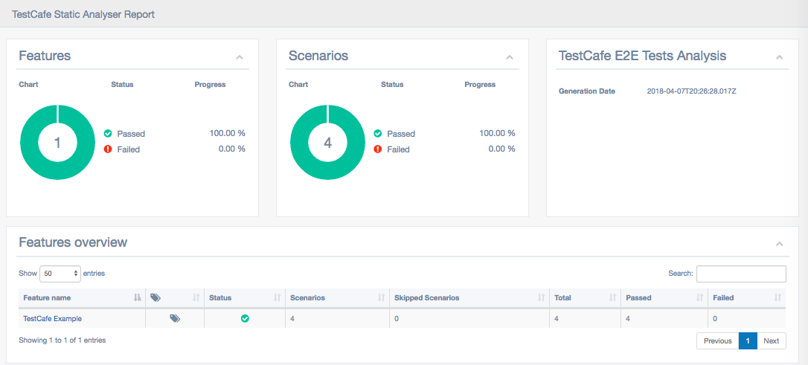
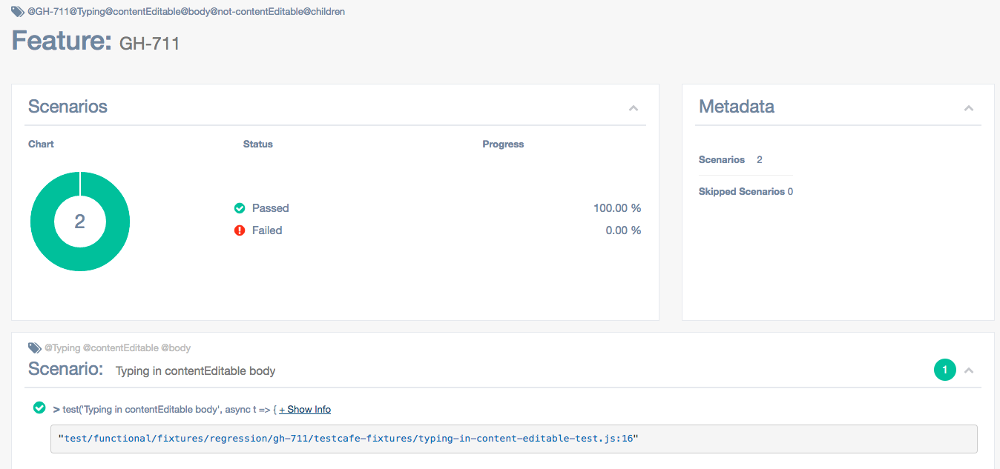

# TestCafe Static Analyser (beta)

## A tool that analyses the source code of your TestCafe tests and generates a nice and searchable html report from it.

**This tool allows you to show fixtures and tests in a [Gherkin-like format](#generating-a-gherkin-like-report), even if you do not use gherkin at all.**

[](https://npmjs.org/package/testcafe-static-analyser)

## To install TestCafe Static Analyser

* run the command `npm install --save-dev testcafe-static-analyser`.

## To start TestCafe Static Analyser

* insert the following script in the `package.json` file:
```javascript
"testcafe-static-analyser": "testcafe-static-analyser"
```
* run the command `npm run testcafe-static-analyser`
    * this will create the `testcafe-static-analyser.json` file
    * in this file, modify the `sourceFiles` section
    * re-run the command 

## To configure TestCafe Static Analyser

* open the [testcafe-static-analyser.json](testcafe-static-analyser.json) file
* to get rid of a tag in the report, add this tag to the `noisyTags` section

## How it works

* Every `fixture` is automatically tagged by analysing its folder hierarchy, its filename, its description and the `.meta` declarations;
* Every `test` is automatically tagged by analysing its description and the `.meta` declarations
* Every `step` that may be present in a `test` is also automatically tagged by analysing its description;
* every tag generated at the `step` and the `test` levels is bubbled up to the `fixture` tags;
* The html report enables you to search/filter `fixtures` by tag.

## How it looks

* Fixtures are reported as Features and tests as Scenarios




## Samples

### TestCafe repo

* running testcafe-static-analyser on the TestCafe repo itself will produce the following report (the report has been filtered with the word `editable`):


* clicking on the `GH-711` will produce the details of the selected fixture:



### generating a gherkin like report 

* the following code:
```javascript
test("Scenario: scenario example", async () => {
  // Only on devci
  code omitted for brevity

  // Given I signed in the App
  code omitted for brevity

  // When I enter my name
  code omitted for brevity

  // And I enter my email
  code omitted for brevity

  // Then I can send my feedback to TestCafe team
  code omitted for brevity
});

```

will produce the following report:


## The vision

* Be able to have an high overview of all existing e2e TestCafe tests;
* Be able to dynamically tag at any level
* Be able to find all tests associated to a specific tag;
* Be able to merge the result of tests executions (need to write a custom testcafe reporter for this purpose);
* Be extensible to enable any third-party to add custom parsers and tags (without cloning the project);
* Be extensible to make the html report customizable (without cloning the project).
