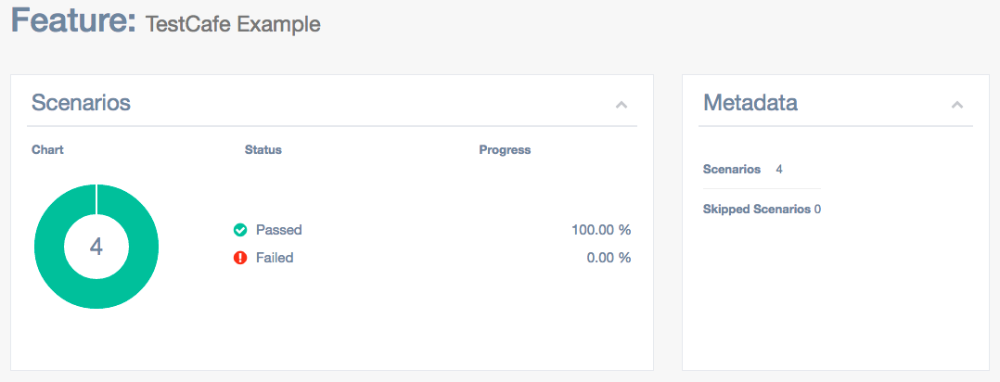

# TestCafe Static Analyser (beta)

## A tool that analyses the source code of your TestCafe tests and generates a nice and searchable html report from it.

Feel free to try this tool on your TestCafe tests and feel free to send a screenshot of the html report to the [issues](https://github.com/hdorgeval/testcafe-static-analyser/issues).

[](https://npmjs.org/package/testcafe-static-analyser)

## To install TestCafe Static Analyser

* run the command `npm install --save-dev testcafe-static-analyser`.

## To start TestCafe Static Analyser

* insert the following script in the `package.json` file:
```javascript
"testcafe-static-analyser": "testcafe-static-analyser"
```
* run the command `npm run testcafe-static-analyser`
    * this will create the `testcafe-static-analyser.json` file
    * in this file, modify the `sourceFiles` section
    * re-run the command 

## To configure TestCafe Static Analyser

* open the [testcafe-static-analyser.json](testcafe-static-analyser.json) file
* to get rid of a tag in the report, add this tag to the `noisyTags` section

## How it works

* Every `fixture` is automatically tagged by analysing its folder hierarchy, its filename and its description;
* Every `test` is automaticall tagged by analysing its description
* Every `step` that may be present in a `test` is also automatically tagged by analysing its description;
* every tag generated at the `step` and the `test` levels is bubbled up to the `fixture` tags;
* The html report enables you to search/filter `fixtures` by tag.

## How it looks

* Fixtures are reported as Features and tests as Scenarios





## The vision

* Be able to have an high overview of all existing e2e TestCafe tests;
* Be able to dynamically tag at any level
* Be able to find all tests associated to a specific tag;
* Be able to merge the result of tests executions (need to write a custom testcafe reporter for this purpose);
* Be extensible to enable any third-party to add custom parsers and tags (without cloning the project);
* Be extensible to make the html report customizable (without cloning the project).
